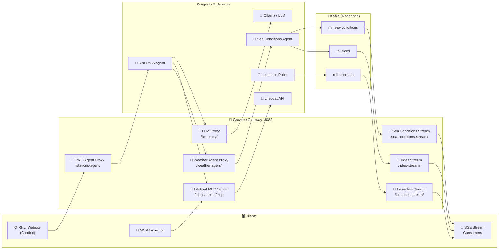

# RNLI Lifeboat Station Finder — Gravitee AI Agent Demo 🚢🤖

A hands-on demonstration of how to build, manage, and observe AI agents using the **Gravitee AI Agent Mesh**. Through the lens of the **RNLI (Royal National Lifeboat Institution)**, this demo showcases a complete AI agent workflow — MCP tool calling, Agent-to-Agent (A2A) orchestration, real-time event streaming via Kafka, and full observability.

---

## ⚡ TL;DR — Quick Start (5 Minutes)

1. **Get Your License** 🔑
   You need a Gravitee Enterprise License. Get a free 2-week trial at [landing.gravitee.io](https://landing.gravitee.io/gravitee-hands-on-ai-workshop).

2. **Install Ollama** 🧠
   *(The LLM runtime that lets the agent "think" and decide which tools to call.)*
   ```bash
   # Install from https://ollama.com/download, then:
   ollama serve
   ollama pull qwen3:0.6b
   ollama list | grep -q 'qwen3:0.6b' && echo "Ollama OK"
   ```

3. **Configure Your License**
   ```bash
   cp .env-template .env
   # Edit .env and set GRAVITEE_LICENSE=<your base64 license>
   ```

4. **Start the Demo** 🚀
   ```bash
   docker compose up -d --build
   ```
   *(First run takes a few minutes — grab a coffee ☕)*

5. **Visit the mock RNLI Website** 🌊
   Open **[http://localhost:8002](http://localhost:8002)** and try these queries:

   - **"What are the nearest lifeboat stations to Brighton?"** — MCP tool call
   - **"What are the sea conditions near Poole?"** — A2A agent-to-agent call
   - **"What stations have I visited?"** — requires login (`joe.doe@gravitee.io` / `HelloWorld@123`)

6. **Watch the Flow** 🔭
   Open the **[AI Agent Inspector](http://localhost:9002)** to see every step visualised in real time.

---

## 🎯 What This Demo Covers

| Concept | Description |
|---------|-------------|
| **MCP Servers** | Transform REST APIs into AI-discoverable tools at the gateway level |
| **LLM Proxy** | Route, observe, and apply guard rails to all LLM traffic centrally |
| **AI Agents** | Agents that reason, plan, and call tools in a loop |
| **A2A (Agent-to-Agent)** | Agents calling other specialised agents through the gateway |
| **Authentication** | OAuth2/OIDC protects user-specific data via Gravitee AM |
| **Fine-Grained Access** | Bronze/Silver/Gold API plans enforce data tiers at the gateway |
| **Kafka Event Streaming** | Publish and consume real-time events through Gravitee MESSAGE APIs |
| **Real-Time Observability** | Every agent step visualised via TCP Reporter + AI Agent Inspector |

---

## 🏗️ Architecture Overview



---

## 🧩 All Services

| Service | URL | Description |
|---------|-----|-------------|
| **RNLI Website** | http://localhost:8002 | Chatbot — talk to the AI agent |
| **AI Agent Inspector** | http://localhost:9002 | Real-time visual trace of every agent step |
| **MCP Inspector** | http://localhost:6274 | Browse and test the MCP server tools |
| **APIM Console** | http://localhost:8084 | API Management — analytics, policies, APIs |
| **APIM Gateway** | http://localhost:8082 | The Gravitee API Gateway |
| **AM Console** | http://localhost:8081 | Access Management (`admin` / `adminadmin`) |
| **Redpanda Console** | http://localhost:8086 | Browse Kafka topics and messages |
| **Lifeboat API** | http://localhost:8001 | Raw REST API |
| **Weather Agent** | http://localhost:8005 | Sea conditions A2A agent (direct) |
| **A2A Agent** | http://localhost:8003 | Main RNLI A2A agent (direct) |

---

## 🚀 Setup

### 1. Get a Gravitee Enterprise License

> **🎁 Free 2-week license:** [landing.gravitee.io/gravitee-hands-on-ai-workshop](https://landing.gravitee.io/gravitee-hands-on-ai-workshop)

```bash
cp .env-template .env
# Edit .env: set GRAVITEE_LICENSE=<your base64 license key>
```

### 2. Download the AI Guard Rails Model

The AI Guard Rails feature uses a DistilBERT ONNX model to classify LLM requests for harmful content at the gateway level.

```bash
pip install huggingface_hub
huggingface-cli download gravitee-io/distilbert-multilingual-toxicity-classifier \
  model.quant.onnx \
  --local-dir apim-gateway-models/gravitee-io/distilbert-multilingual-toxicity-classifier/
```

> Without it the gateway starts normally but the AI Guardrails policy will not enforce content checks.

### 3. Install Ollama

```bash
# Install from https://ollama.com/download, then:
ollama serve
ollama pull qwen3:0.6b
```

### 4. Launch

```bash
docker compose up -d --build
```

Allow **3–4 minutes** for all services to be ready. The `gio-gravitee-init` container runs once to import all APIs and configure AM.

---

## 📖 How It Works

### Part 1: MCP — REST API as AI Tool 🔧

The **RNLI Lifeboat API** is a standard REST API. Gravitee's **MCP Entrypoint** transforms its endpoints into MCP tools that AI agents can discover and call automatically.

The demo exposes four tools via `/lifeboat-mcp/mcp`:

| Tool | Maps to | Description |
|------|---------|-------------|
| `findNearestStations` | `GET /stations/nearest` | Find stations near a UK postcode or town |
| `listStationsByType` | `GET /stations?type=` | List ALB or ILB stations |
| `listStationsByRegion` | `GET /stations?region=` | List stations in a UK/Ireland region |
| `getVisitedStations` | `GET /history` | Get the user's visited station history |

**Explore with MCP Inspector** — open [http://localhost:6274](http://localhost:6274), select **Streamable HTTP**, and the URL is pre-filled.

---

### Part 2: LLM Proxy 🧠

All LLM traffic goes through the Gravitee **LLM Proxy** at `/llm-proxy/`, providing:
- **Observability** — every LLM call is visible in APIM Analytics
- **AI Guard Rails** — toxicity classifier blocks harmful prompts before they reach the LLM (threshold: 0.95)
- **Rate limiting** and **5-minute response caching**

---

### Part 3: The AI Agent Loop 🤖

```
Discover tools → Decide which tool → Execute via Gravitee MCP → Reflect and respond
```

Every call goes through the Gravitee Gateway. Ask *"What are the nearest stations to Brighton?"* — watch every step in the AI Agent Inspector.

---

### Part 4: A2A — Agent-to-Agent 🤝

Ask *"What are the sea conditions near Poole?"* to see Agent-to-Agent in action:

1. **RNLI A2A Agent** receives the query and recognises it needs sea conditions data
2. Agent calls the **Sea Conditions Agent** via `/weather-agent/` (routed through Gravitee)
3. Sea Conditions Agent fetches wave heights, wind speed, swell, and tidal data from open APIs
4. Sea Conditions Agent publishes the full response to Kafka (`rnli.sea-conditions`, `rnli.tides`)
5. Response flows back through Gravitee to the RNLI Agent and then to the user

The AI Agent Inspector shows the full A2A call chain. Select the **"A2A Agent Mesh"** scenario in the Inspector for a pre-built animation of this flow.

---

### Part 5: Kafka Event Streaming 📡

Every sea conditions query and every lifeboat launch publishes to Kafka. Three Gravitee **MESSAGE APIs** expose these topics as live SSE streams.

#### Topics

| Topic | Published by | Contains |
|-------|-------------|---------|
| `rnli.sea-conditions` | Sea Conditions Agent (on every A2A query) | Full weather data — wave heights, wind, swell, tidal events |
| `rnli.tides` | Sea Conditions Agent (on every A2A query) | Tidal events only (filtered subset) |
| `rnli.launches` | Launches Poller (every 30s from RNLI API) | Lifeboat launch events |

#### Subscribe to live streams

```bash
# Live sea conditions — fires every time someone asks a sea conditions question
curl -N -H "Accept: text/event-stream" http://localhost:8082/sea-conditions-stream/

# Tidal events only
curl -N -H "Accept: text/event-stream" http://localhost:8082/tides-stream/

# Lifeboat launches
curl -N -H "Accept: text/event-stream" http://localhost:8082/launches-stream/
```

Then ask *"What are the sea conditions near Poole?"* on the website — the sea-conditions and tides streams fire within seconds.

#### Simulate a launch event (for demo)

The Launches Poller polls the RNLI API every 30 seconds. To simulate a new launch immediately without waiting:

```bash
curl -X POST "http://localhost:18082/topics/rnli.launches" \
  -H "Content-Type: application/vnd.kafka.json.v2+json" \
  -d '{
    "records":[{
      "key":"demo-001",
      "value":{
        "id":99001,
        "shortName":"Poole",
        "title":"Two persons reported in the water off Sandbanks Peninsula",
        "launchDate":"2026-03-19T17:45:00Z",
        "lifeboat_IdNo":"B-894",
        "cOACS":"Cat 1",
        "website":"https://rnli.org/find-my-nearest/lifeboat-stations/poole-lifeboat-station"
      }
    }]
  }'
```

Anyone subscribed to `http://localhost:8082/launches-stream/` will receive the event immediately.

#### Browse topics in Redpanda Console

Open **[http://localhost:8086](http://localhost:8086)** — browse `rnli.sea-conditions`, `rnli.tides`, and `rnli.launches`, view messages, and inspect offsets.

#### Pull records directly via Kafka HTTP Proxy

Gravitee also exposes Redpanda's HTTP Proxy at `/kafka-proxy/` for governed REST-based produce/consume:

```bash
# Consume latest records from sea-conditions topic
curl "http://localhost:8082/kafka-proxy/topics/rnli.sea-conditions/partitions/0/records?offset=0&count=5" \
  -H "Accept: application/vnd.kafka.json.v2+json"
```

#### Note on Native Kafka (port 9094)

The gateway has port 9094 exposed for Gravitee's native Kafka gateway. However, Gravitee's native Kafka routing requires TLS/SNI to identify which API to route a connection to — even in port-routing mode. Without TLS, connections time out at the dispatcher level (`No Kafka acceptor found for SNI null`). This is a known constraint; for a local demo without TLS infrastructure, use the SSE streams or HTTP proxy instead. The SSE streams through Gravitee tell the same governance story (rate limiting, auth, analytics) without TLS complexity.

---

### Part 6: Authentication & Fine-Grained API Access 🔐

#### Authentication — RNLI Data Portal Login

1. Open [http://localhost:8002](http://localhost:8002) and ask *"What stations have I visited?"* — returns a generic fallback
2. Click **Sign In** and log in with `joe.doe@gravitee.io` / `HelloWorld@123`
3. Ask again — the agent now knows who you are and returns Joe's visit history

#### Fine-Grained Access — Bronze / Silver / Gold Tiers

| Tier | Auth | Columns |
|------|------|---------|
| **Bronze** | None | 4 — id, name, type, region |
| **Silver** | API Key `X-Gravitee-Api-Key: 592eafe3-fdf4-4a58-aeaf-e3fdf42a586b` | 8 — adds country, lat, lon, address |
| **Gold** | JWT via OAuth2 login | 12 — adds crew count, launches/year, launch history |

```bash
# Bronze (no auth)
curl -s -X POST http://localhost:8082/databricks-stations/api/2.0/sql/statements \
  -H "Content-Type: application/json" -d '{"statement":"SELECT * FROM stations"}'

# Silver (API key)
curl -s -X POST http://localhost:8082/databricks-stations/api/2.0/sql/statements \
  -H "Content-Type: application/json" \
  -H "X-Gravitee-Api-Key: 592eafe3-fdf4-4a58-aeaf-e3fdf42a586b" \
  -d '{"statement":"SELECT * FROM stations"}'
```

---

### Part 7: AI Agent Inspector 🔭

The **AI Agent Inspector** at [http://localhost:9002](http://localhost:9002) shows every step as a live sequence diagram. It receives JSON events from the Gravitee Gateway's built-in **TCP Reporter** — no agent instrumentation required.

**Scenario picker** (top-right):
- **MCP Tool Call** — standard lifeboat station query
- **A2A Agent Mesh** — sea conditions query showing the A2A call chain
- **Live** — shows actual real-time traffic as it happens

---

## 🔧 Gravitee APIs Registered

All APIs are auto-imported by the `gio-gravitee-init` container at startup:

| File | API Name | Type | Path/Port |
|------|----------|------|-----------|
| `01-lifeboat-api.json` | RNLI Lifeboat API | PROXY | `/lifeboat-api/` |
| `02-rnli-agent.json` | RNLI Agent Proxy | PROXY | `/stations-agent/` |
| `03-llm-proxy.json` | LLM Proxy | LLM_PROXY | `/llm-proxy/` |
| `04-visited-stations.json` | Visited Stations | PROXY | `/visited-stations/` |
| `05-lifeboat-mcp.json` | Lifeboat MCP Server | PROXY | `/lifeboat-mcp/` |
| `06-databricks-stations.json` | Databricks Stations | PROXY | `/databricks-stations/` |
| `07-weather-agent.json` | Sea Conditions Agent | PROXY | `/weather-agent/` |
| `08-kafka-proxy.json` | Kafka HTTP Proxy | PROXY | `/kafka-proxy/` |
| `09-launches-stream.json` | RNLI Launches Stream | MESSAGE | `/launches-stream/` |
| `10-sea-conditions-stream.json` | Sea Conditions Stream | MESSAGE | `/sea-conditions-stream/` |
| `11-tides-stream.json` | Tides Stream | MESSAGE | `/tides-stream/` |
| `12-native-kafka-launches.json` | Launches Native Kafka | NATIVE | port `9094` |

To re-run API registration (e.g. after config changes):
```bash
docker compose build gio-gravitee-init && docker compose run --rm gio-gravitee-init
```

---

## 🏁 Stopping

```bash
docker compose down
```

---

## 🔧 Troubleshooting

### Guard Rails blocking normal queries

The toxicity classifier sensitivity is set to `0.95` (in `docker-compose.yml` `GUARD_RAILS_THRESHOLD`). If queries are being blocked, raise it further or re-run `gio-gravitee-init`:

```bash
# Edit docker-compose.yml: GUARD_RAILS_THRESHOLD=0.98
docker compose run --rm gio-gravitee-init
docker compose restart gio-apim-gateway
```

### Slow or timing out responses

Run Ollama locally (faster than containerised, especially on Apple Silicon):
```bash
ollama serve && ollama pull qwen3:0.6b
```
The LLM Proxy routes to `http://host.docker.internal:11434/v1` automatically.

### gravitee-init fails mid-way

Re-run it:
```bash
docker compose run --rm gio-gravitee-init
```

### Kafka SSE stream shows only `retry:` line

That's correct — `retry:` is a standard SSE reconnect directive, not a heartbeat. The stream is live and waiting. Publish an event or trigger a sea conditions query to see data flow.

### Launches Poller not publishing

The RNLI launches API (`services.rnli.org`) may time out from inside Docker (CDN/IP blocking). Use the simulate command above to publish test events directly to Redpanda. The Kafka infrastructure and SSE streams work correctly regardless.

### Apple Silicon (M1/M2/M3)

Tested and optimised for Apple Silicon:
- MongoDB healthcheck via TCP (not `mongosh`)
- Elasticsearch `start_period: 60s`
- Gateway inference timeout `120000ms` for ONNX model warmup

---

## 📚 Learn More

- [Model Context Protocol (MCP)](https://modelcontextprotocol.io/)
- [A2A Protocol](https://google.github.io/A2A/)
- [Gravitee AI Agent Mesh](https://www.gravitee.io/)
- [Redpanda](https://redpanda.com/)
- [RNLI](https://rnli.org/) — *The Royal National Lifeboat Institution saves lives at sea*

---

**Happy exploring! 🌊🚀**

Sam
