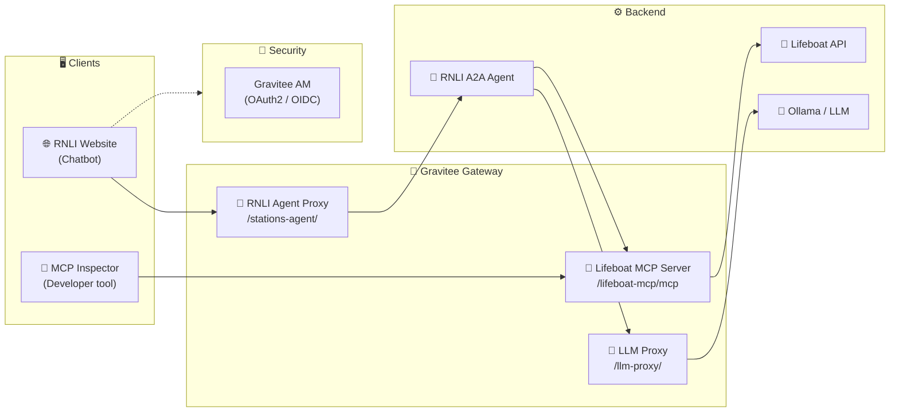
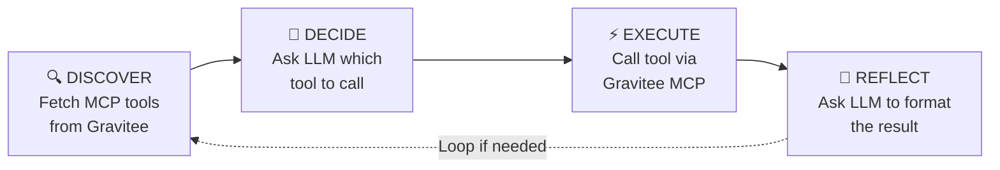

# RNLI Lifeboat Station Finder — Gravitee AI Agent Demo 🚢🤖

A hands-on demonstration of how to build, manage, and observe AI agents using the **Gravitee AI Agent Mesh**. Through the lens of the **RNLI (Royal National Lifeboat Institution)**, this demo showcases a complete AI agent workflow — from natural-language user queries to real-time visual observability.

---

## ⚡ TL;DR — Quick Start (5 Minutes)

1. **Get Your License** 🔑
   You need a Gravitee Enterprise License. Get a free 2-week trial at [landing.gravitee.io](https://landing.gravitee.io/gravitee-hands-on-ai-workshop).

2. **Install Ollama** 🧠
   *(The LLM runtime that lets the agent "think" and decide which tools to call.)*
   ```bash
   # Install from https://ollama.com/download, then:
   ollama serve
   ollama pull qwen3:0.6b
   ollama list | grep -q 'qwen3:0.6b' && echo "Ollama OK"
   ```

3. **Configure Your License**
   ```bash
   cp .env-template .env
   # Edit .env and set GRAVITEE_LICENSE=<your base64 license>
   ```

4. **Start the Demo** 🚀
   ```bash
   docker compose up -d --build
   ```
   *(First run takes a few minutes — grab a coffee ☕)*

5. **Visit the mock RNLI Website** 🌊
   Open **[http://localhost:8002](http://localhost:8002)** and chat with the AI agent:

   - **"What are the nearest lifeboat stations to Brighton?"**
     *Finds 5 nearby stations with addresses and walking directions*

   - **"Show me all-weather lifeboat stations in Scotland"**
     *Uses two tools in combination*

   - **"What stations have I visited?"**
     *Requires login — sign in with `joe.doe@gravitee.io` / `HelloWorld@123`*

   - **After logging in:** *"When did I last visit a lifeboat station?"*
     *Returns personalised visit history*

6. **Demo Fine-Grained Access** 🏅 *(Optional)*
   Try the three-tier data API directly:
   ```bash
   # Bronze — no auth, 4 columns
   curl -s -X POST http://localhost:8082/databricks-stations/api/2.0/sql/statements \
     -H "Content-Type: application/json" -d '{"statement":"SELECT * FROM stations"}'

   # Silver — API key, 8 columns
   curl -s -X POST http://localhost:8082/databricks-stations/api/2.0/sql/statements \
     -H "Content-Type: application/json" \
     -H "X-Gravitee-Api-Key: 592eafe3-fdf4-4a58-aeaf-e3fdf42a586b" \
     -d '{"statement":"SELECT * FROM stations"}'
   ```

7. **Watch the Flow** 🔭
   Open the **[AI Agent Inspector](http://localhost:9002)** to see every step visualised in real time as you chat.

---

## 🎯 What You'll Learn

| Concept | Description |
|---------|-------------|
| **MCP Servers** | How to transform REST APIs into AI-discoverable tools |
| **LLM Proxy** | How to route and proxy Large Language Model traffic through the gateway |
| **AI Agents** | How agents reason, plan, and execute actions in a loop |
| **Authentication** | How OAuth2/OIDC protects user-specific data via Gravitee AM |
| **Fine-Grained Access** | How Bronze/Silver/Gold API plans enforce data tiers at the gateway |
| **Real-Time Observability** | How to visualise every step of an AI Agent flow as it happens |

---

## 🏗️ Architecture Overview



| Component | Purpose |
|-----------|---------|
| **RNLI Lifeboat API** | REST API serving station data (locations, types, visited history) |
| **RNLI A2A Agent** | AI agent that orchestrates MCP tools and LLM to answer user queries |
| **LLM Proxy** | Gravitee gateway proxy routing LLM requests to Ollama |
| **Lifeboat MCP Server** | Gravitee V4 API exposing station tools via Model Context Protocol |
| **RNLI Agent Proxy** | Gravitee proxy fronting the A2A agent (keyless, with CORS) |
| **Gravitee AM** | OAuth2/OIDC server — issues tokens for authenticated Gold Member access |
| **AI Agent Inspector** | Real-time visual sequence diagram of every agent step |
| **MCP Inspector** | Developer tool to browse and test the MCP server tools |

---

## 🚀 Setting Up Your Environment

### 1. Get a Gravitee Enterprise License

The MCP Server and AI features require a **Gravitee Enterprise License**.

> **🎁 Free 2-week license:** [landing.gravitee.io/gravitee-hands-on-ai-workshop](https://landing.gravitee.io/gravitee-hands-on-ai-workshop)

Once you have your base64-encoded license, create your `.env` file:

```bash
cp .env-template .env
# Edit .env: set GRAVITEE_LICENSE=<your base64 license key>
```

### 2. Download the AI Guard Rails Model

The **AI Guard Rails** feature uses a DistilBERT ONNX model to classify LLM requests for harmful content at the gateway level — before they reach the LLM. The model is published publicly by Gravitee on Hugging Face but is too large to include in this repo (129 MB).

```bash
# Install the Hugging Face CLI if you don't have it
pip install huggingface_hub

# Download the quantised ONNX model into the correct directory
huggingface-cli download gravitee-io/distilbert-multilingual-toxicity-classifier \
  model.quant.onnx \
  --local-dir apim-gateway-models/gravitee-io/distilbert-multilingual-toxicity-classifier/
```

> The model is mounted into the Gravitee Gateway container automatically via `docker-compose.yml`.
> Without it the gateway starts normally but the AI Guardrails policy will not enforce content checks.

Model on Hugging Face: [gravitee-io/distilbert-multilingual-toxicity-classifier](https://huggingface.co/gravitee-io/distilbert-multilingual-toxicity-classifier)

### 3. Install Ollama (Recommended)

Running Ollama locally is faster than containerised inference (especially on Apple Silicon).

```bash
# Install from https://ollama.com/download, then:
ollama serve
ollama pull qwen3:0.6b
ollama list | grep -q 'qwen3:0.6b' && echo "Model ready"
```

### 3. Launch the Environment

```bash
docker compose up -d --build
```

All services start automatically, including:
- Gravitee APIM + AM
- RNLI Lifeboat API
- RNLI A2A Agent
- AI Agent Inspector

The `gravitee-init` container runs once to import all APIs and configure AM. Allow **3–4 minutes** for all services to be ready.

### 4. Available Services

| Service | URL | Description |
|---------|-----|-------------|
| **RNLI Website** | http://localhost:8002 | Chatbot — talk to the AI agent |
| **AI Agent Inspector** | http://localhost:9002 | Real-time visual trace of every agent step |
| **MCP Inspector** | http://localhost:6274 | Browse and test the MCP server tools |
| **APIM Console** | http://localhost:8084 | API Management — analytics, policies, APIs |
| **APIM Gateway** | http://localhost:8082 | The Gravitee API Gateway |
| **AM Console** | http://localhost:8081 | Access Management (login: `admin` / `adminadmin`) |
| **Lifeboat API** | http://localhost:8001 | Raw REST API (internal, also at `/lifeboat-api/` via gateway) |

---

## 📖 How It Works

### Part 1: REST API → AI-Ready Tool with MCP 🔧

The **RNLI Lifeboat API** is a standard REST API. On its own, an AI agent has no way to know what it does or how to call it. The **Model Context Protocol (MCP)** solves this by providing a standard interface that AI agents can use to *discover* and *call* tools.

Gravitee's **MCP Entrypoint** transforms any REST endpoint into an MCP tool with a single configuration:

```
REST endpoint:  GET /stations/nearest?location=Brighton
MCP tool:       findNearestStations({ location: "Brighton" })
```

The RNLI demo exposes four tools via the Gravitee MCP Server at `/lifeboat-mcp/mcp`:

| Tool | Maps to | Description |
|------|---------|-------------|
| `findNearestStations` | `GET /stations/nearest` | Find stations near a UK postcode or town |
| `listStationsByType` | `GET /stations?type=` | List ALB or ILB stations |
| `listStationsByRegion` | `GET /stations?region=` | List stations in a UK/Ireland region |
| `getVisitedStations` | `GET /history` | Get the user's visited station history |

#### 🔍 Explore with MCP Inspector

Open **[http://localhost:6274](http://localhost:6274)**:

1. Select **"Streamable HTTP"** as the transport
2. The server URL is pre-filled: `http://gio-apim-gateway:8082/lifeboat-mcp/mcp`
3. Click **Connect** — you'll see all four tools listed
4. Click any tool and call it with sample inputs

> **💡 Key Insight:** MCP is a standard protocol. Any MCP-compatible client (Claude Desktop, VS Code, Cursor, custom agents) can use this server to find lifeboat stations.

---

### Part 2: LLM Proxy 🧠

The agent uses an LLM (via Ollama) to decide *which MCP tool to call* and to *format the response* into natural language. All LLM traffic goes through the Gravitee **LLM Proxy** at `/llm-proxy/`, providing:

- **Single entry point** for all LLM traffic
- **Observability** — every LLM call is logged and visible in Gravitee's Analytics
- **Control** — routing, rate limiting, and guard rails can be added without touching agent code using Gravitee's UI
- **Gateway-level timeout management** — protects against slow LLM responses

You can see all LLM calls in the **APIM Console** at [http://localhost:8084](http://localhost:8084) — navigate to the **LLM Proxy** API → **Analytics**.

---

### Part 3: The AI Agent Loop 🤖

The RNLI agent follows a four-phase reasoning loop for every user query:



| Phase | What Happens |
|-------|--------------|
| **Discover** | On startup, agent calls `tools/list` on the Gravitee MCP Server |
| **Decide** | Agent sends user query + tool definitions to LLM via LLM Proxy |
| **Execute** | Agent calls the chosen tool via `tools/call` on the MCP Server |
| **Reflect** | Agent sends tool result back to LLM to generate a natural-language answer |

Every call in this loop goes through the **Gravitee Gateway** — all traffic is visible in APIM analytics.

#### Example: "What are the nearest stations to Brighton?"

1. LLM receives the query + tool definitions → decides to call `findNearestStations`
2. Agent calls `tools/call` → Gravitee routes to `GET /stations/nearest?location=Brighton`
3. LLM receives station data → formats it into a friendly response with addresses and map links

---

### Part 4: Authentication & Fine-Grained API Access 🔐

This demo showcases two complementary access control features.

#### 4a. Authentication — RNLI Data Portal Login

Some data requires authentication. The `/history` endpoint (visited stations) is protected: you need to be logged in to fetch your personal visit history.

**How it works:**

1. User logs in via the RNLI website using **Gravitee AM** (OAuth2/OIDC)
2. AM issues a JWT access token containing user identity and plan claims
3. The website prefixes the user's chat message with their context: `[USER_CONTEXT:{name, plan, visits}]`
4. The agent reads this context and personalises its responses

The login is triggered by clicking **Sign In** on the RNLI website — this starts the OAuth2 PKCE flow and redirects to the RNLI-branded AM login form (with decorative social login buttons — demo only). Do not navigate to the AM login URL directly; it requires OAuth2 parameters to work correctly.

**Try it:**

1. Open [http://localhost:8002](http://localhost:8002) and ask *"What stations have I visited?"* — this returns a generic fallback (no identity)
2. Click **Sign In** and log in with:
   - Email: `joe.doe@gravitee.io`
   - Password: `HelloWorld@123`
3. Ask again — the agent now knows who you are and returns Joe's visit history

#### 4b. Fine-Grained API Access — Bronze / Silver / Gold Tiers

The **RNLI Databricks Stations API** demonstrates gateway-enforced data tiers. Three API plans control what data each caller can see — no backend changes required.

| Tier | Auth Method | Gateway Path | Columns Returned |
|------|-------------|--------------|-----------------|
| **Bronze** | None (Keyless) | `POST /databricks-stations/...` | 4 — id, name, type, region |
| **Silver** | API Key (`X-Gravitee-Api-Key`) | same path + header | 8 — adds country, lat, lon, address |
| **Gold** | JWT (via Gravitee AM OAuth2) | same path + `Authorization: Bearer` | 12 — adds crew count, launches/year, launch history |

The gateway injects an `X-RNLI-Plan` header before the request reaches the backend, which selects the appropriate data tier. The plan check happens entirely at the gateway — the backend never sees credentials.

**Try it — curl:**

```bash
# Bronze (no auth) — 4 columns
curl -s -X POST http://localhost:8082/databricks-stations/api/2.0/sql/statements \
  -H "Content-Type: application/json" \
  -d '{"statement":"SELECT * FROM stations"}' | python3 -m json.tool

# Silver (API key) — 8 columns
curl -s -X POST http://localhost:8082/databricks-stations/api/2.0/sql/statements \
  -H "Content-Type: application/json" \
  -H "X-Gravitee-Api-Key: 592eafe3-fdf4-4a58-aeaf-e3fdf42a586b" \
  -d '{"statement":"SELECT * FROM stations"}' | python3 -m json.tool
```

**Demo accounts:**

| User | Credentials | Tier |
|------|-------------|------|
| Joe Doe (Gold) | `joe.doe@gravitee.io` / `HelloWorld@123` | JWT via OAuth2 |
| Silver Subscriber | `silver.user@rnli.org` / `HelloWorld@123` | API Key (auto-provisioned) |
| Anyone | No credentials | Bronze (Keyless) |

---

### Part 5: Real-Time Observability — AI Agent Inspector 🔭

The **AI Agent Inspector** at [http://localhost:9002](http://localhost:9002) shows every step of the agent flow as a live sequence diagram, updated in real time as you chat.

It works by receiving JSON events from the Gravitee Gateway's built-in **TCP Reporter**, which streams every request event to the inspector's Node.js server. No agent code changes needed.

**What you see for each query:**

```
User Request       → Client sends query to Agent Proxy
LLM Tool Decision  → Agent asks LLM which tool to call (with tool definitions)
Tool Discovery     → Agent fetches available tools from MCP Server
Tool Call          → Gravitee routes tool call to Lifeboat API
LLM Response       → Agent asks LLM to format the tool result
Agent Response     → Agent returns natural language answer to user
```

> **💡 This is the full observable A2A loop** — every HTTP call, LLM interaction, and MCP tool call is captured and visualised without any instrumentation in the agent code itself.

---

## 🏁 Stopping the Demo

```bash
docker compose down
```

---

## 🎓 Key Takeaways

| Concept | What You Learned |
|---------|-----------------|
| **MCP Servers** | Transform REST APIs into AI-discoverable tools at the gateway level |
| **LLM Proxy** | Centralise, observe, and control all LLM traffic through a single gateway |
| **Agent Architecture** | Agents follow a Discover → Decide → Execute → Reflect loop |
| **Authentication** | OAuth2/OIDC protects user-specific data; tokens carry identity and context |
| **Fine-Grained Access** | Bronze/Silver/Gold API plans enforce data tiers at the gateway with zero backend changes |
| **Observability** | Every agent step is visible in real time via the TCP Reporter + Agent Inspector |

---

## 🔧 Troubleshooting

### Slow or Timing Out Responses

**Cause:** LLM inference is running on CPU (slow).

**Fix:** Run Ollama locally instead of in Docker:
```bash
ollama serve
ollama pull qwen3:0.6b
```
Then `docker compose up -d` — the gateway's LLM Proxy will route to `http://host.docker.internal:11434/v1`.

### gravitee-init Fails Mid-Way

The init container runs once. If it fails partway through:
```bash
docker compose up -d --force-recreate gio-gravitee-init
```

### Gateway Starts Before Agent Inspector

If the gateway starts before `agent-live-graph` is ready, the TCP reporter connection will be retried automatically. The inspector will start receiving events once it's running.

### Apple Silicon (M1/M2/M3)

This demo is tested and optimised for Apple Silicon. The docker-compose includes:
- MongoDB healthcheck via TCP (not `mongosh`, which is slow on ARM64)
- Elasticsearch `start_period: 60s` to allow for slow ARM64 startup
- Gateway inference timeout `120000ms` for ONNX model warmup

---

## 📚 Learn More

- [Model Context Protocol (MCP) Specification](https://modelcontextprotocol.io/)
- [A2A Protocol Documentation](https://google.github.io/A2A/)
- [Gravitee AI Agent Mesh](https://www.gravitee.io/)
- [RNLI](https://rnli.org/) — *The Royal National Lifeboat Institution saves lives at sea*

---

**Happy exploring! 🌊🚀**

Sam 
